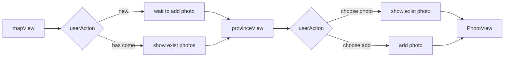

# IOS-goTraveling
- ios homework
- 2019/1/11
- 161220129  王奕琛
- 15838185471wyc@gmail.com

## 功能简介
- 当您到某个地方旅行时，可以在地图上的相应位置进行标注。
  
- 您可以在该标注中添加旅行时的照片。
  
- 您可以对每一张照片都起一个名字，或是记录下拍下这张照片时的感想
  
- 您的行走记录和照片会一直保存在这个app中，您可以随时翻起您的回忆

## 使用说明
- 首次启动时，您的界面为一张中国地图，上面有许多绿色的小旗；
- 当您去某个地方旅行时，点击对应的小旗的加号，您可以在这里添加照片；
- 点击右上角的+号，添加有意义的照片到app中，你可以给照片起名字，并记录下拍这张照片时的感想；
- 您随时可以删除一些您不需要的照片；
- 当您在一个地区添加有照片后，您在该地区的小旗会变为红色；
- 多出去旅行，努力把更多的小旗染红吧！

## 代码设计：

- mapView负责加载省份信息，如果用户是第一次使用则创建所有省份信息并保存，默认所有省份为未到达状态。之后每次都加载本地信息。对用户是否到达地分别进行不同的处理。
- 河南省和江苏省为尝试进行的填充处理，效果理想。定义继承自MKPolygon的MyPolygon来区分填充颜色，对到达过的省份填充红色，否则为白色。
- 大头针添加点击事项添加或显示详细信息。根据用户是否到达过该地进行判断。大头针颜色也依据此变化。
- 点击大头针切换到provinceView,显示当前省份地图，并显示当前省份对应的存储图片。使用tableList展示每个图片及其名称和详细情况。
- 点击照片切换到PhotoView，展示照片并可编辑照片。
- 由于使用高德API尝试获取行政区边界失败，暂时无法使用对行政区着色的表示方法，改用小旗表示，行政区的填充仅对河南省和江苏省进行以保证填充过程无误。之后会尝试使用高德API获取行政区边界并对各省份进行填充。
